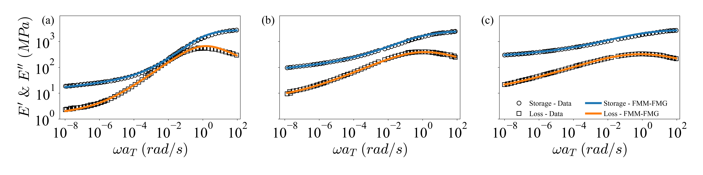
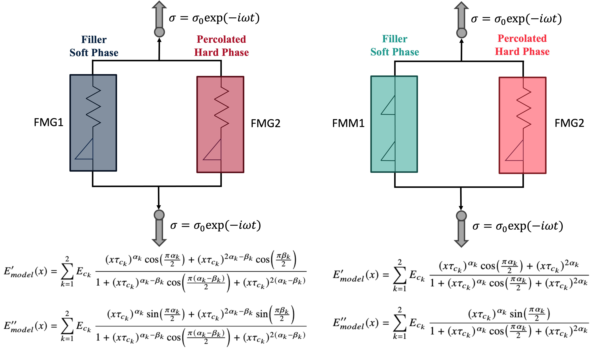
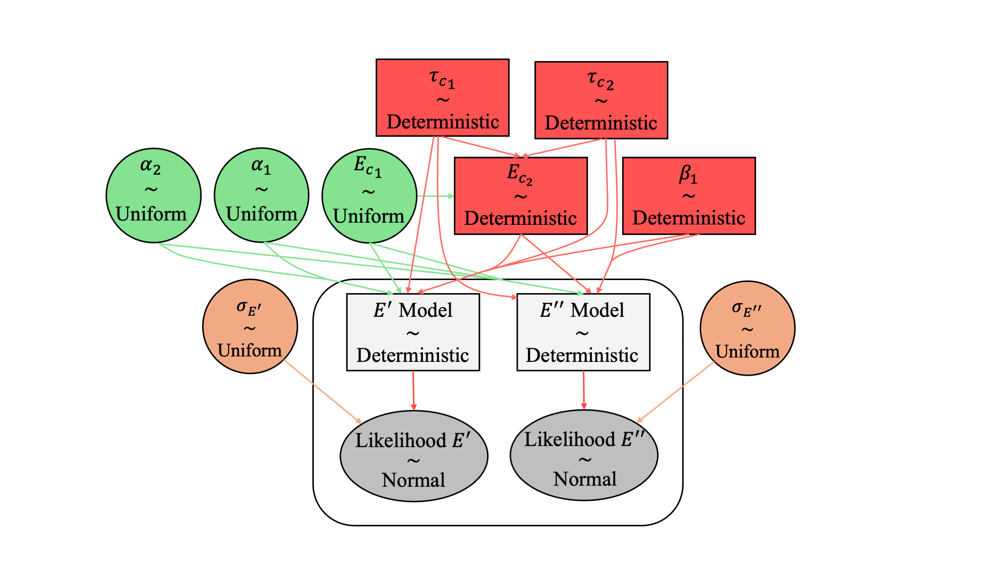
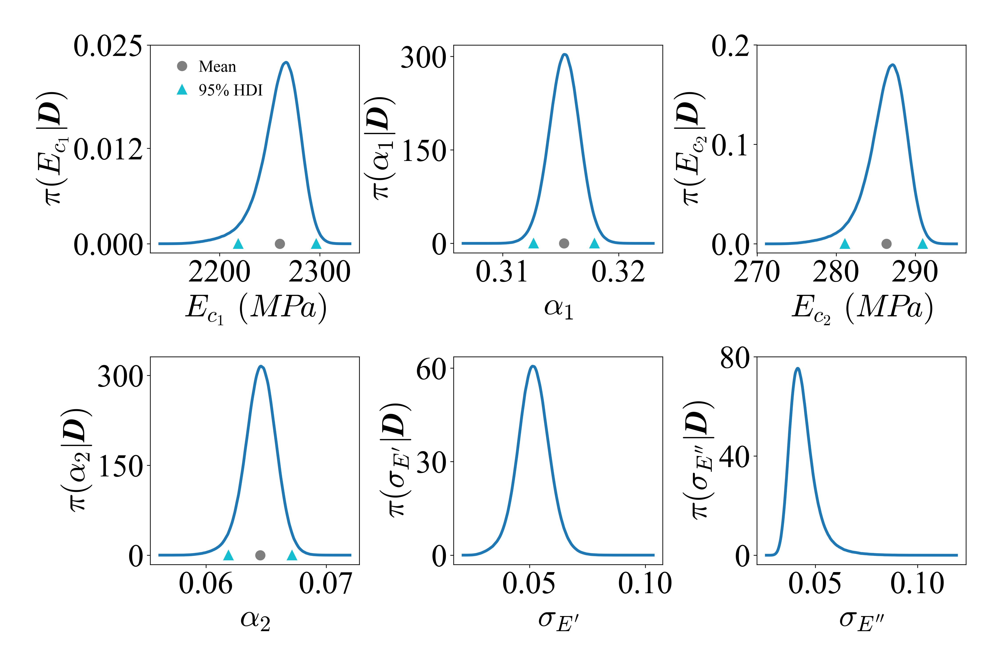
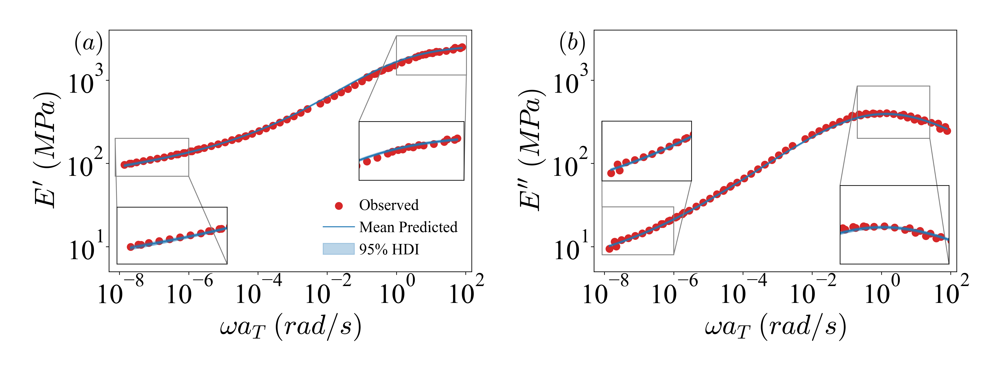

# Bayesian Calibration and Uncertainty Quantification for Fractional-Order Constitutive Models
Welcome to the documentation for the **Bayesian Inference and Uncertainty Quantification of Fractional-Order Constitutive Models** framework. This repository provides computational tools to apply machine learning and Bayesian inference techniques to complex mechanical models.

## Overview
Fractional-order constitutive models are powerful tools for capturing the memory-dependent and anomalous behavior of materials, especially thoese with power-law behavior spanned across decades of time scales. In this study and repository, Bayesian calibration with MCMC sampling technique (NUTS algorithm in PyMC package) are utilized to infere the model parameters, construct their posterior distributions, and quantify the uncertainties in the model responses.

## Documentaion
A thorough documentation can be found [here](https://armankhoshnevis.github.io/BI-and-UQ-of-Fractional-Order-Constitutive-Models/).

## Repository Structure
* **`configs/`**: Configuration files for setting up MCMC chains, priors, and model hyperparameters.
* **`datasets/`**: Synthetic experimental dataset and optimized model parameters used for the calibration process.
* **`notebooks/`**: Jupyter notebook equivalents of the python codes for interactive use.
* **`scripts/`**: Main inference script, helper functions, and post-processing scripts.
* **`results/`**: Output directories for trace plots, posterior distributions, predictive checks, etc.

## Installation
First, clone the repository and navigate into the project directory:
```bash
git clone git@github.com:armankhoshnevis/BI-and-UQ-of-Fractional-Order-Constitutive-Models.git
cd BI-and-UQ-of-Fractional-Order-Constitutive-Models
```

### Option A: Python venv & pip (Recommended for Running Locally)
If it is preferred to use standard Python virtual environments locally, `pip` alongside the `requirements.txt` file can be used. Then, execute the following commands:
```bash
python -m venv env

# On Windows:
.\env\Scripts\activate

# On macOS/Linux:
source env/bin/activate

pip install -r requirements.txt
```

### Option B: Conda (Recommended for Running on Clusters)
If it is preferred to run the codes on a cluster, `environment.yml` file is used to ensure exact dependency and Python version matching. Then, execute the following commands:
```bash
module load Miniforge3 # Replace with your specific cluster's module if different
conda env create -f environment.yml
conda activate UQ_Project
```

## Quick Run
### Running Locally
Once your environment is activated (via Conda or venv), navigate to the `script` directory and execute the Python files directly from your terminal:
```bash
cd script
python MCMC_FMG_Inference.py --HS 20
python MCMC_FMG_Inference_PostProcessing.py --HS 20
```

### Running on a SLURM Cluster
If you are running the inference on a cluster that uses the SLURM workload manager, a sample batch script (`MCMC_FMG.sh` and `MCMC_FMM.sh`) is provided. The script is pre-configured to activate the UQ_Project conda environment.
```bash
cd script
sbatch MCMC_FMG.sb
```

*Note:* The script's output and any errors will be automatically logged to standard `.out` and `.err` files in the working directory.

## Results Sumamry










## Citation Requirements
If you use this software, please cite it and its corresponding paper, as:
- Software citation:
  - APA style: Khoshnevis, A. (2026). Bayesian Calibration and Uncertainty Quantification for Fractional-Order Constitutive Models (Version 1.0.0) [Computer software]. https://github.com/armankhoshnevis/BI-and-UQ-of-Fractional-Order-Constitutive-Models

  - BibTeX entry:<br>
    @software{Khoshnevis_Bayesian_Calibration_and_2026, <br>
    author = {Khoshnevis, Arman},<br>
    license = {Apache-2.0},<br>
    month = mar,<br>
    title = {{Bayesian Calibration and Uncertainty Quantification for Fractional-Order Constitutive Models}},<br>
    url = {https://github.com/armankhoshnevis/BI-and-UQ-of-Fractional-Order-Constitutive-Models},<br>
    version = {1.0.0},<br>
    year = {2026}<br>
    }

- Paper citation: Will be provided once published.
