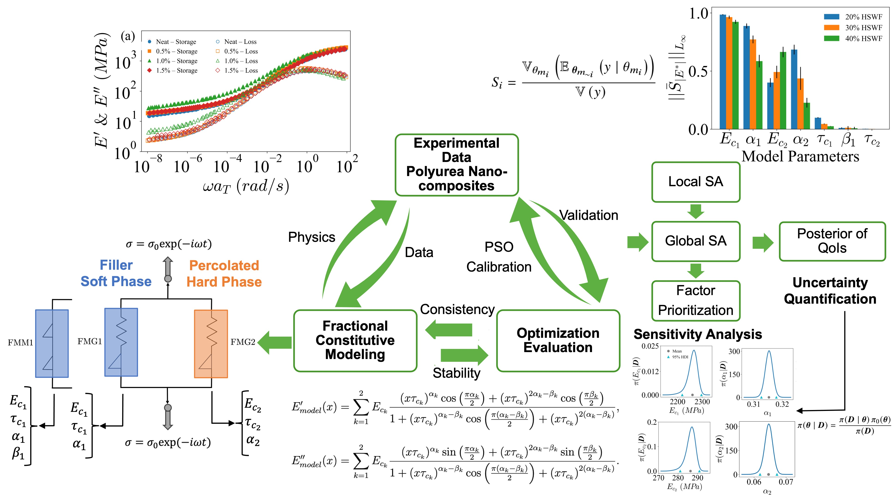

# Bayesian Calibration and Uncertainty Quantification for Fractional-Order Constitutive Models

This repository provides a computational framework for conducting Bayesian inference and uncertainty quantification on fractional-order constitutive models. The framework relies on the PyMC package, a probabilistic programming library design for robust construction of inference problems. Specifically, Bayesian calibration with MCMC sampling technique (NUTS algorithm in PyMC package) are utilized to infere the model parameters, construct their posterior distributions, and quantify the uncertainties in the model responses.

# Big Picture
This repository is a part of a larger project aiming to develop a framework for deterministic and probabilistic calibration of fractional-order constitutive models capturing the linear viscoelastic response of polyurea nanocomposites. Deterministic calibration has been accomplished with PSO ([Optimization Repository](https://github.com/armankhoshnevis/Optimization-of-Fractional-Order-Constitutive-Models)), while derivative-based local sensitivity analysis (LSA) and variance-based global sensitivity analysis (GSA) have been conducted as a bridge toward a probabilistic perspective ([Sensitivity Analysis Repository](https://github.com/armankhoshnevis/Sensitivity-Analysis-of-Fractional-Order-Constitutive-Models)). These analyses facilitate factor prioritization and dimensionality reduction by identifying non-influential parameters that can be treated deterministically. Finally, Bayesian inference and uncertainty quantification (UQ) have been performed to conclude this comprehensive model development and analysis framework. The figure below depicts a schematic overview of this framework. This repository focuses specifically on the Bayesian inference and uncertainty quantification components.



## Repository Structure
* **`configs/`**: Configuration files for setting up MCMC chains, priors, and model hyperparameters.
* **`datasets/`**: Synthetic experimental dataset and optimized model parameters used for the calibration process.
* **`notebooks/`**: Jupyter notebook equivalents of the python codes for interactive use.
* **`scripts/`**: Main inference script, helper functions, and post-processing scripts.
* **`results/`**: Output directories for trace plots, posterior distributions, predictive checks, etc.

## Installation
First, clone the repository and navigate into the project directory:
```bash
git clone git@github.com:armankhoshnevis/BI-and-UQ-of-Fractional-Order-Constitutive-Models.git
cd BI-and-UQ-of-Fractional-Order-Constitutive-Models
```

### Option A: Python venv & pip (Recommended for Running Locally)
If it is preferred to use standard Python virtual environments locally, `pip` alongside the `requirements.txt` file can be used. Then, execute the following commands:
```bash
python -m venv env

# On Windows:
.\env\Scripts\activate

# On macOS/Linux:
source env/bin/activate

pip install -r requirements.txt
```

### Option B: Conda (Recommended for Running on Clusters)
If it is preferred to run the codes on a cluster, `environment.yml` file is used to ensure exact dependency and Python version matching. Then, execute the following commands:
```bash
module load Miniforge3 # Replace with your specific cluster's module if different
conda env create -f environment.yml
conda activate UQ_Project
```

## Quick Run
### Running Locally
Once your environment is activated (via Conda or venv), navigate to the `scripts` directory and execute the Python files directly from your terminal:
```bash
cd scripts
python MCMC_FMG_Inference.py --HS 20
python MCMC_FMG_Inference_PostProcessing.py --HS 20
```

### Running on a SLURM Cluster
If you are running the inference on a cluster that uses the SLURM workload manager, a sample batch script (`MCMC_FMG.sh` and `MCMC_FMM.sh`) is provided. The script is pre-configured to activate the UQ_Project conda environment.
```bash
cd scripts
sbatch MCMC_FMG.sh
```

**Note:** The script's output and any errors will be automatically logged to standard `.out` and `.err` files in the working directory.

## Workflow Automation with Snakemake

To streamline repeated runs across multiple hard-segment (HS) cases and to automate both inference and post-processing, a lightweight workflow has been implemented using **Snakemake**. The workflow is configured through `configs/workflow/workflow_cases.yaml`, where the desired HS values are listed, and executed through the root `Snakefile`.

The workflow currently supports both the **FMG** and **FMM** Bayesian inference pipelines. For each selected HS value, Snakemake first runs the corresponding inference script and then triggers the associated post-processing script for visualization and posterior analysis. Hidden marker files (for example, `.20HSWF_fmg_run_done` and `.20HSWF_fmg_vis_done`) are used internally to track completed steps and avoid unnecessary reruns.

### Dry Run
A dry run previews the jobs that Snakemake would execute without actually running them:
```bash
snakemake -n -p
```
Since `fmg_all` is set as the default target, this command previews the FMG workflow. To preview the FMM workflow explicitly, use:
```bash
snakemake -n -p fmm_all
```

### Actual Run
To run the default FMG workflow:
```bash
snakemake --cores 1 -p
```
To run the FMM workflow explicitly:
```bash
snakemake --cores 1 -p fmm_all
```

## Documentation
Please refer to this [link](https://armankhoshnevis.github.io/BI-and-UQ-of-Fractional-Order-Constitutive-Models/) for more comprehensive documentations.

## Citation Requirements
If you use this software, please cite it and its corresponding paper, as:

* **Software citation:**
  * **APA style:** Khoshnevis, A. (2026). Bayesian Calibration and Uncertainty Quantification for Fractional-Order Constitutive Models (Version 1.0.0) [Computer software]. https://github.com/armankhoshnevis/BI-and-UQ-of-Fractional-Order-Constitutive-Models

  * **BibTeX entry:** <br>
    @software{Khoshnevis_Bayesian_Calibration_and_2026, <br>
    author = {Khoshnevis, Arman},<br>
    license = {Apache-2.0},<br>
    month = mar,<br>
    title = {{Bayesian Calibration and Uncertainty Quantification for Fractional-Order Constitutive Models}},<br>
    url = {https://github.com/armankhoshnevis/BI-and-UQ-of-Fractional-Order-Constitutive-Models},<br>
    version = {1.0.0},<br>
    year = {2026}<br>
    }

  * **Paper citation:** Will be provided once published.

## Contributions
This repository is a static archive of the project code. The software is provided "as-is" and is not actively maintained. Please see [CONTRIBUTING.md](CONTRIBUTING.md) for more details.

## Acknowledgements

### Funding & Grants

* **ARO Young Investigator Program (YIP):** Supported under Award No. W911NF-19-1-0444.

* **National Science Foundation (NSF):** Supported under Award No. DMS-1923201.

* **Open Scholarship Fellowship:** Supported by NSF Award No. 2429466 through the MSU Data Hub and by the MSU Institute for Cyber-Enabled Research (ICER). This fellowship specifically supported the open-sourcing of this codebase.

### Principal Investigator
* [Dr. Mohsen Zayernouri](https://fmath.msu.edu/), Michigan State University.

### Computing Resources
We gratefully acknowledge the Michigan State University Institute for Cyber-Enabled Research (ICER) for providing the High-Performance Computing (HPC) resources used to perform the simulations and analyses in this work.
